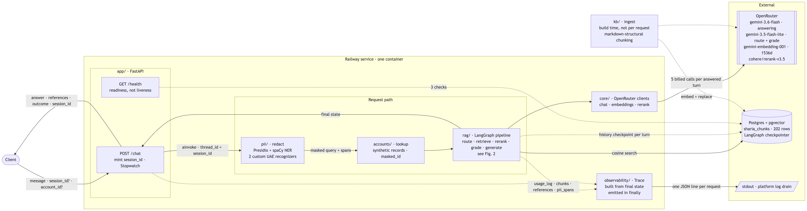
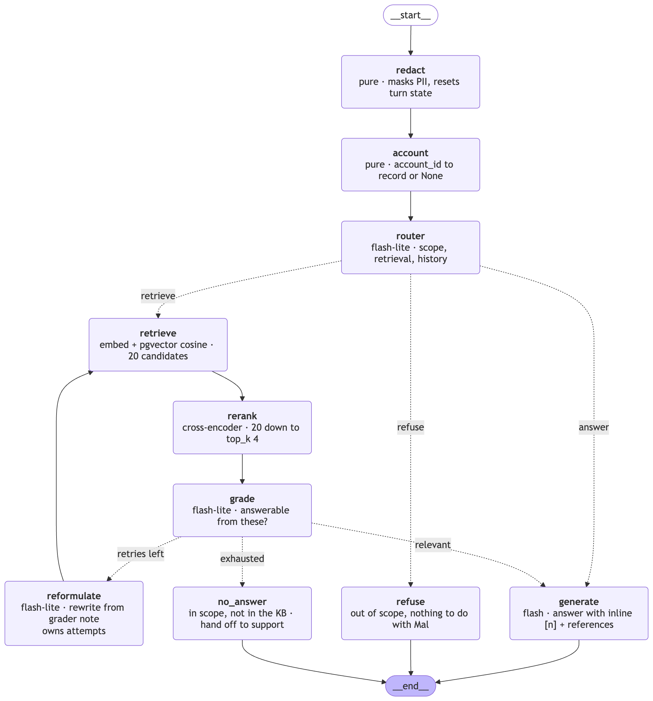

# Mal — Islamic Finance RAG Assistant

An AI assistant for **Mal**, a (fictional) Islamic bank. It answers Sharia-finance
questions grounded in a knowledge base of five product guides, blends in the
customer's own account context when an account id is supplied, redacts PII before
anything reaches an LLM, and emits one structured trace line per request.

**Live:** https://amused-reflection-production-a4d1.up.railway.app/docs

```bash
curl -X POST https://amused-reflection-production-a4d1.up.railway.app/chat \
  -H "Content-Type: application/json" \
  -d '{"message": "How much is left to pay on my Murabaha contract?",
       "account_id": "MAL-1001-2200-4417"}'
```

```json
{
  "answer": "Under your Murabaha contract (MUR-****-0417), your total sale price is AED 13,080.00, and you have paid 5 of your 12 monthly instalments... The remaining contractual balance is AED 7,630.00 [1][2][3]...",
  "references": [{"n": 1, "doc": "murabaha-everyday-finance", "chunk_id": "murabaha-everyday-finance#011"}, ...],
  "outcome": "answered",
  "session_id": "cd74d8500b0a40f9bc07512da6c1245f"
}
```

Send the returned `session_id` back on the next request and the conversation
continues — follow-ups like *"can I settle it early?"* resolve against history.

## What was built

- **RAG over a synthetic Sharia-finance corpus** — five hand-written product
  guides (Murabaha, Ijara, Sukuk, Wakala, Takaful + a late-payment/charity
  policy), chunked on the documents' own structure into 202 chunks, embedded
  into pgvector. Answers cite chunk ids inline (`[n]`) and in a structured
  `references` list.
- **Two-stage retrieval** — vector search fetches 20 candidates, a
  cross-encoder reranker cuts them to 4. An LLM grader then decides whether an
  answer can honestly be written from them; if not, the query is reformulated
  and retried (max 2 retries) before handing over to support.
- **PII redaction before any LLM call** — names (spaCy NER), Emirates IDs,
  account numbers, IBANs, emails, phones. Placeholders like `[EMIRATES_ID]`
  keep the message answerable; the raw value never reaches a prompt, a log, a
  trace, or the session store.
- **Account context** — three synthetic demo accounts (ids are in the Swagger
  docs). The record is attached inside the graph, so answers combine personal
  figures with cited product rules. Identifiers in records exist only
  display-masked (`MAL-****-****-4417`, `MUR-****-0417`) — there is no full
  number anywhere to leak.
- **Observability** — every request writes one JSON line to stdout: latency,
  route and reason, retrieved chunk ids, relevance scores (cross-encoder and
  cosine), grader verdict, per-node token usage and cost, outcome.
- **Evals** — the three required suites (grounding, PII redaction, refusal)
  plus retrieval quality, runnable offline; live variants pin real model
  behaviour.

## Architecture

Everything runs as one container on Railway beside a single Postgres, which
backs both pgvector retrieval and session state. OpenRouter is the only other
external service; `kb/ingest` runs at build time, never per request; traces go
to stdout where the platform's log drain picks them up.



## How a request flows

The pipeline is a [LangGraph](https://docs.langchain.com/oss/python/langgraph)
state graph. LangGraph is deliberately **wiring only** — one file
(`rag/graph.py`) imports it; nodes and state are framework-free functions, and
its Postgres checkpointer is what gives `/chat` sessions for free.



| Node | Job |
|---|---|
| `redact` | Mask PII; reset per-turn state. Everything downstream sees masked text only. |
| `account` | Resolve `account_id` to a synthetic record (or `None`). |
| `router` | One cheap structured call: refuse / answer directly / retrieve — and rewrite the turn into a standalone query using history ("is *it* halal?" → the product the customer meant). |
| `retrieve` → `rerank` | pgvector cosine top-20 → `cohere/rerank-v3.5` top-4. |
| `grade` | LLM verdict: can an answer be written from these passages (plus the account record, if attached)? |
| `reformulate` | On a failed grade, rewrite the search query using the grader's note and retry. |
| `generate` | Answer with inline `[n]` citations, grounded in passages + account record. |
| `refuse` / `no_answer` | Terminal: out-of-scope refusal, or an honest "not in the KB" handover to support. |

Design choices that matter (the long-form rationale lives in `CLAUDE.md`):

- **Two model tiers.** Router and grader run on every request and use
  `gemini-3.5-flash-lite`; only `generate` gets `gemini-3.6-flash`. This is the
  main cost lever.
- **Relevance is the grader's decision alone.** No cosine threshold — numeric
  cutoffs don't transfer across embedding models. Scores are logged for the
  trace, never gated on.
- **Refusal is narrow.** Anything about Mal or the customer's account routes to
  retrieval; if the KB can't answer, support handover is the honest outcome.
  Refusal is only for turns unrelated to Islamic finance or Mal entirely.
- **Masking by construction, not filtering.** Full account numbers exist only
  as lookup keys; records carry masked display forms, so prompts and traces
  cannot leak them even in principle.

## Stack

| Layer | Choice |
|---|---|
| API | FastAPI + uvicorn (async end to end) |
| Orchestration | LangGraph `1.2.9` + Postgres checkpointer (sessions) |
| Vector store | Postgres + pgvector (one database also backs sessions) |
| LLMs | OpenRouter — `google/gemini-3.6-flash` (answers), `google/gemini-3.5-flash-lite` (routing/grading) |
| Embeddings | `google/gemini-embedding-001` @ 1536 dims |
| Reranker | `cohere/rerank-v3.5` |
| PII | Presidio + spaCy `en_core_web_lg` + custom UAE recognizers |
| Packaging | uv, exact-pinned dependencies |

## Run it locally

Prerequisites: [uv](https://docs.astral.sh/uv/), Docker, an
[OpenRouter](https://openrouter.ai/) API key.

```bash
git clone git@github.com:Mahmoudatari/mal-rag-assignment.git
cd mal-rag-assignment
uv sync                                  # installs everything, spaCy model included

# 1. A Postgres with pgvector
docker run -d --name mal-pg -p 5432:5432 \
  -e POSTGRES_PASSWORD=pg -e POSTGRES_DB=mal pgvector/pgvector:pg17

# 2. Configuration
cp .env.example .env
#    set OPENROUTER_API_KEY=sk-or-...
#    set DATABASE_URL=postgresql://postgres:pg@localhost:5432/mal

# 3. Build the index (applies the schema, chunks, embeds, ~$0.01)
uv run python -m kb.ingest

# 4. Serve
uv run uvicorn app.main:app --reload
```

Open http://localhost:8000/docs and try the pre-filled example, or:

```bash
curl -X POST localhost:8000/chat -H "Content-Type: application/json" \
  -d '{"message": "What is Murabaha and how is the markup decided?"}'
```

Traces appear on stdout, one JSON line per request.

## Tests and evals

```bash
uv run pytest              # unit tests + evals — offline, no key needed
uv run pytest tests/       # unit tests only
uv run pytest evals/       # the assignment's eval suites
uv run pytest -m live      # opt-in: real OpenRouter + built index, costs money
```

`tests/` proves the wiring with fakes; `evals/` asserts the graded behaviours
(grounding, PII redaction, refusal, retrieval quality). Anything touching a
real provider is marked `live` and deselected by default. Tests that write to
a database are marked `db` and take a separate `TEST_DATABASE_URL` so they can
never touch the deployed index.

## Deploy to Railway

The repo ships its deploy config: a two-stage `Dockerfile` and `railway.toml`
(Dockerfile builder, `/health` as the readiness gate — a deploy that cannot
answer questions never replaces one that can).

```bash
railway init                      # or: railway link, for an existing project
# In the Railway dashboard:
#   1. Add a Postgres service from the pgvector template
#   2. On the app service, set OPENROUTER_API_KEY and DATABASE_URL
#      (reference the Postgres service's connection string), plus any
#      overrides from .env.example

railway up                        # build + deploy the working tree

# Build the index once, from your machine, against the database's PUBLIC
# connection string (the *.railway.internal host only resolves inside Railway):
DATABASE_URL=postgresql://...proxy.rlwy.net:PORT/railway uv run python -m kb.ingest
```

`GET /health` reports document/chunk counts and fails if any part of the index
was embedded by a model other than the configured one — the one mismatch that
would otherwise degrade retrieval silently.

## Layout

```
core/            config, LLM/embedding/rerank clients (OpenRouter via openai SDK)
app/             FastAPI routes, schemas, trace emission
kb/              corpus documents, structure-aware chunking, ingest, pgvector store
rag/             LangGraph graph, state, one module per node
pii/             detector + masker — pure, importable with no key and no network
accounts/        synthetic customer records + prompt renderers
observability/   trace schema + JSON emitter
tests/           unit tests (fakes, no network)
evals/           grounding, PII redaction, refusal, retrieval
```

Synthetic data only; no real customer information anywhere. Secrets live in
environment variables — `.env.example` documents the names.
